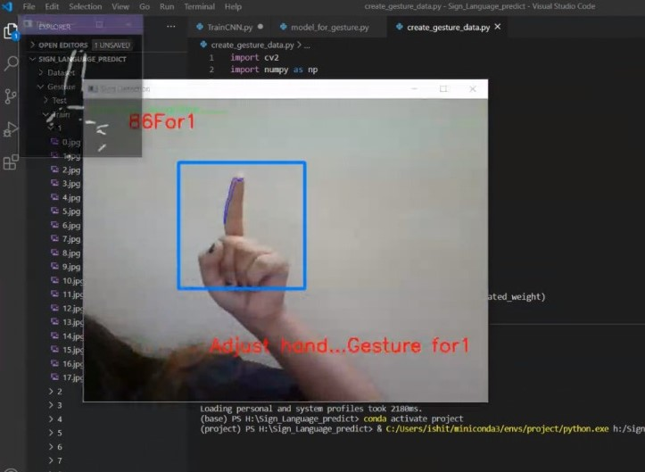

# SignLanguagePredictor
Sign language Predictor using python Machine Learning. We used Tensorflow, Opencv and Keras. Created out own small dataset
This can be very helpful for the deaf and dumb people in communicating with others as knowing sign language is not something that is common to all, moreover, this can be extended to creating automatic editors, where the person can easily write by just their hand gestures.  

Our model was able to predict the Numbers in the ASL with a prediction accuracy >95%. You can add as many gestures as you want

Try to save the File in H: directory to avoid changing address in code.

